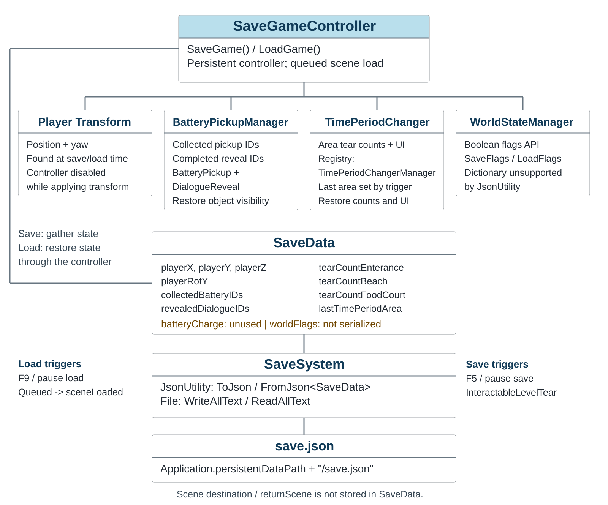

# Birds of Impalitism

Unity Save System Documentation

<!-- page -->

# Unity Save System Documentation

## Overview

When a player returns to a level, they expect their route, collected items, and area progress to be where they left them. The save system connects those player expectations to the systems that own each value. `SaveGameController` gathers the values into one `SaveData` snapshot. `SaveSystem` writes that snapshot as JSON to `Application.persistentDataPath + "/save.json"` and reads it back when loading.

The design separates three jobs: gameplay components update progression, the controller coordinates a save or load, and the file service handles JSON and disk access. Persistent managers carry state between scenes. Stable IDs let a newly opened scene match a saved completion to the right pickup or dialogue reveal.

The game has one save file. It stores progress, not the active scene; the menu and level-return flow choose a destination. There is no file version or recovery path for damaged JSON.

The sections follow the original design document. Their explanations use the current implementation so a designer or programmer can see who owns each value, what a save changes for the player, and which older design terms no longer match the scripts.

**Scope:** Source review of the local Birds-of-Impalatism Unity 2022.3.17f1 project, October 3, 2026. The flow describes script behavior and required references; gameplay was not executed during this review. Existing inspector images on the website document an earlier version.

**Read the diagram:** The boxes group responsibilities and the connecting lines show their relationships. On save, the controller reads the player and progression systems, builds `SaveData`, and asks `SaveSystem` to write the file. On load, those values return to the player, scene objects, and area UI. The color highlights the controller described in the original flow diagrams; field names match the C# source.

<!-- page -->

# Key Components

## 1. SaveGameController.cs

**Path:** `Assets/Script/SaveSystem/SaveGameController.cs`

**Prefab:** `Assets/Script/SaveSystem/SaveGameController.prefab`

The controller is the coordinator: it asks each gameplay system for the data needed to resume, then sends the assembled snapshot to the file service. Place it in the scene hierarchy. In `Awake()`, it removes duplicates, survives scene changes with `DontDestroyOnLoad`, and listens for a queued load after a scene opens.

- `SaveGame()` finds the player, creates `SaveData`, gathers progression from its managers, and calls `SaveSystem.Save(data)`. If no player is present, there is no complete snapshot to write, so the method returns.
- `LoadGame()` reads the file and returns if either the data or player is missing. It briefly disables the player's `CharacterController` while setting position and yaw, then restores the controller and progression state.
- `StartNewGame()` clears saved and in-memory progress before play begins: it deletes the file, clears pickup and reveal IDs and flags, resets tear counts, and returns a currently found player to the origin.
- F5 calls `SaveGame()`; F9 calls `LoadGame()`. Pause menu methods call the same public functions.

**Design connections:** Assign `worldManager` and `batteryManager`. The player is found through `FirstPersonController`, or by the `Player` tag as a fallback. The area manager supplies each registered `TimePeriodChanger`, which owns the tear-count display for its area.

**Memory state:** `shouldAutoLoadGame` gates a load after a scene change. `lastTimePeriodArea` is copied to the save data. `returnScene` is retained on the controller for level return routing, but is not a save field.

**Prefab note:** The base prefab still contains older serialized names such as `batteryTracker` and `chunkManager`. MainMenu, Mall, and ExperimentArea contain overrides for the current manager references. Verify effective scene references in the inspector.

<!-- page -->

# Key Components

## 2. SaveData.cs

**Path:** `Assets/Script/SaveSystem/SaveData.cs`

`SaveData` is the contract between gameplay code and the file service. It holds values rather than scene behavior, so the controller can gather state without teaching the JSON writer about pickups, UI, or player components. Code creates it for each save; it is not a scene component.

- `playerX`, `playerY`, `playerZ` (float) and `playerRotY` (float): the position and yaw to put the player back where they stopped. The code uses `playerRotY`; the old document called it `playerRotationY`.
- `collectedBatteryIDs` (`List<string>`): the stable pickup IDs that let each level hide an item the player already collected.
- `revealedDialogueIDs` (`List<string>`): completed `DialogueReveal` IDs, so the scene can keep the revealed objects visible after a return. The save tracks completion, not the current dialogue line.
- `tearCountEnterance`, `tearCountBeach`, `tearCountFoodCourt` (int): the pickup and reveal totals for each area. The source spells the first field `Enterance`; changing that name would also change the JSON schema.
- `lastTimePeriodArea` (`TimePeriodArea`): the most recently entered area, used to show the relevant tear-count UI after loading.
- `batteryCharge` (float): left over from an earlier battery design. The current controller neither assigns nor restores it.
- `worldFlags` (`Dictionary<string, bool>`): the controller passes the flag dictionary through, but Unity 2022.3 `JsonUtility` does not serialize dictionaries. Flag changes therefore are not saved in this JSON file.

## 3. SaveSystem.cs

**Path:** `Assets/Script/SaveSystem/SaveSystem.cs`

`SaveSystem` keeps file access out of gameplay code. `Save(data)` writes JSON; `Load()` rebuilds `SaveData`. `SaveExists()` supports Continue; `Delete()` supports New Game.

<!-- page -->

# Battery System

## Area progression: TimePeriodChanger.cs

**Path:** `Assets/Script/TimePeriodChanger.cs`

The original design described charge levels. The current gameplay flow counts progress by area instead. `BatteryTracker` and its half-charge methods are no longer in the C# source, and `batteryCharge` is not connected to a runtime value.

`TimePeriodChanger` connects a completed pickup or dialogue reveal to the area's progress display. It increments a shared count for Entrance, Beach, or FoodCourt and updates the number the player sees.

- Entering an area updates `lastTimePeriodArea`, which tells the load flow which count panel to show.
- `SaveToData(data)` copies all three counts into the snapshot so progress in one area does not replace progress in another.
- `LoadFromData(data)` restores the counts and refreshes the area's display.
- `ResetAllCounts()` sets the counts to zero and refreshes registered changer UI for New Game.

The interface displays `/3` for Entrance, `/4` for Beach, and `/5` for FoodCourt. These values show the intended target to the player; the increment method does not enforce those limits.

**Setup:** Select the `TimePeriodArea`, assign `currentTearCount` and `tearCountMax`, and configure the trigger's text/audio/animation references. The manager must exist when the changer's `Awake()` registers it.

<!-- page -->

# Battery System

## Area progression methods and data ownership

These methods keep the progress rule and its UI response together:

- `UpdateTearAmount()`: increments this changer's area's shared count.
- `SaveToData(data)` and `LoadFromData(data)`: move the three area totals between gameplay and the snapshot.
- `UpdateTearUIForArea(areaToShow)`: shows the selected count and its target.
- `ResetAllCounts()`: resets progress and updates registered displays for New Game.

Pickups and completed dialogue reveals both add one to an area's count, but they record separate IDs. Keeping both means a load can restore which object is complete and the total shown in the UI. The total is saved directly; it is not recalculated from the ID lists.

`TimePeriodChangerManager` maps area names to their changer components. The controller asks the registered changers to save or restore the shared counts, then refreshes the changer for `lastTimePeriodArea`. This gives each scene access to the same area totals and the right display after a return.

The old `AddCharge`, `UseCharge`, `GetCurrentChargeLevel`, and `SetCharge` methods belonged to `BatteryTracker`. The current save design describes area totals and completion IDs instead, because those are the values the gameplay code owns now.

<!-- page -->

# Battery System

## BatteryPickup.cs

**Script:** `Assets/Script/BatterySystem/BatteryPickup.cs`

**Prefab:** `Assets/Script/BatterySystem/BatteryPickup.prefab`

Give each pickup a stable, unique `pickupID`. This is how a level recognizes an item after the player returns, even though the scene has created a new pickup object. Despite its battery name, the current pickup reveals connected objects and adds one area tear; it does not add charge.

- `Awake()` finds `BatteryPickupManager` and reads whether the ID is already collected.
- `Start()` hides a collected ordinary pickup and activates its `objectsToReveal`. A pickup with `levelTear` enabled stays visible.
- `OnTriggerEnter()` ignores other objects, checks whether this ID was already collected, reveals linked objects, and records a new completion through `MarkCollected(pickupID)`.
- The trigger resolves the area's changer through `areaLocation` and `TimePeriodChangerManager`, then falls back to the assigned `tearCounter` or a matching scene changer. It calls `UpdateTearAmount()` when a changer is found.
- On load, `ResetPickupState(manager)` applies that record to the level: an uncollected pickup is available and its linked objects are hidden; a collected ordinary pickup is hidden and its linked objects are shown.

`areaLocation` accepts Entrance or Enterance, Beach, and FoodCourt after trimming spaces and changing case. If the manager is missing, a local guard prevents repeated collection for that object during the current scene, but the guard is not written to the save file.

**Design requirement:** Author IDs once and keep them unchanged between runs. Avoid duplicate or empty IDs. Use `levelTear` for an entry object that should remain visible after collection.

<!-- page -->

# Battery System

## BatteryPickupManager.cs

**Script:** `Assets/Script/BatterySystem/BatteryPickupManager.cs`

**Prefab:** `Assets/Script/BatterySystem/BatteryPickupManager.prefab`

The manager holds the collected pickup IDs and completed dialogue reveal IDs while the game runs. `DontDestroyOnLoad` carries those sets between scenes. The manager exports lists for the save file, then rebuilds its sets from those lists on load.

- Pickup queries and changes: `IsCollected(id)` and `MarkCollected(id)`.
- Pickup save export: `GetCollectedBatteries()`.
- Pickup restore: `LoadCollectedBatteries(list)` rebuilds the set, finds `BatteryPickup` components including inactive objects, and calls `ResetPickupState(this)`.
- Reveal queries and changes: `IsDialogueRevealed(id)` and `MarkDialogueRevealed(id)`.
- Reveal save export: `GetRevealedDialogues()`.
- Reveal restore: `LoadRevealedDialogues(list)` rebuilds the set, finds `DialogueReveal` components including inactive objects, and calls `ResetRevealState(this)`.

When a scene opens, its objects query the persistent manager so they can reflect current progress. This handles ordinary scene changes, where state stays in memory and no file load runs.

**Setup note:** The duplicate check counts `SaveGameController` instances, not battery managers. The load methods expect ID lists to be present and do not validate their contents.

<!-- page -->

# Goggle Chunk System

## Current reveal component: DialogueReveal.cs

**Path:** `Assets/Script/Interaction System/DialogueReveal.cs`

Goggle-chunk activation and charge were part of an earlier design. The current reveal flow records completed `DialogueReveal` interactions as `revealedDialogueIDs`. That is the scene progression a player can complete and the save can restore in the current source.

`DialogueReveal` extends `InteractableDisplay`. Finishing its interaction reveals the linked objects, adds one tear to its assigned area, and records its ID with `BatteryPickupManager`. The ID lets that reveal stay complete when the player returns.

- At scene start, the component checks the manager and sets object visibility for a reveal already completed.
- When a saved list is loaded, `ResetRevealState(manager)` restores object visibility and the local completion check.
- The local `revealed` check prevents the same interaction from adding another tear in that scene.

**ID requirement:** Assign a stable, unique `revealId` in the inspector. If it is empty, `Awake()` makes a new GUID at runtime. Because that value can change on a later run, the saved completion might no longer match the reveal in the scene.

**Area setup:** The completion code compares exact strings: `Beach`, `Enterance`, and `FoodCourt`. Assign the matching `tearCounter`. This string handling differs from BatteryPickup's tolerant area parsing.

Only reveal completion is saved. Current text line, typing position, conversation history, and `GhostGoggleInteraction.hasPlayed` are not represented in `SaveData`.

<!-- page -->

# Goggle Chunk System

## Current manager and entry flow

**Manager:** `Assets/Script/TimePeriodChangerManager.cs`

This manager links each `TimePeriodArea` to the component that updates its display. That lets a pickup or reveal report progress for its area and lets the save controller refresh area counts after loading. The registration dictionary contains live scene component references, so it is runtime wiring rather than saved progress.

`RegisterChanger(area, changer)` creates or replaces an area's reference. `GetChanger(area)` resolves its display owner; `GetAllChangers()` supplies the components used during save and load. Changers register in `Awake()` if the manager already exists. There is no unregister or stale-reference cleanup, so scene setup and initialization order matter.

**Level entry:** `Assets/Script/InteractableLevelTear.cs`

Completing this interaction is the designed save point before level entry. `InteractableLevelTear` saves progression, remembers the current scene on the persistent controller, and then loads its configured level. Saving before leaving ties the player's level-entry choice to a clear progress snapshot.

**Level return:** `GameController` queues loading after a win, selects the recorded return scene or `LevelSelect`, and changes scenes. `LevelPauseMenuManager.ReturnToReturnScene()` uses the same queued return pattern. `LevelSelectManager.LoadLevel()` records a return scene, but does not call `SaveGame()`.

**Earlier assets:** A prefab named `GoggleChunkManager` remains under `Assets/Script/BatterySystem`, but it contains a Transform only. The current controller does not reference a chunk manager. Earlier inspector screenshots show the former setup and should be captioned as development history.

<!-- page -->

# World Flags

## WorldStateManager.cs

**Script:** `Assets/Script/SaveSystem/WorldStateManager.cs`

**Prefab:** `Assets/Script/SaveSystem/WorldStateManager.prefab`

The manager holds a private `Dictionary<string, bool>` and uses `DontDestroyOnLoad`. `SetFlag(key, value)` sets an entry; `GetFlag(key)` returns true only when the entry exists and is true. `SaveFlags()` returns a copy; `LoadFlags(flags)` replaces the dictionary with a copy.

The controller passes the flags dictionary into `SaveData` on save and gives the loaded value back to `LoadFlags()`.

**Serialization limitation:** Unity 2022.3 `JsonUtility` does not support dictionaries. There is no conversion to a supported format, so flags can affect in-memory state but do not persist across a game restart through this JSON file.

`LoadFlags()` assumes it receives a dictionary. If deserialization leaves that value null, copying it can throw before pickups, reveals, and area totals are restored. The controller has no null check, which makes this a risk when loading a file without that field.

**Project usage:** Other current scripts do not call `SetFlag()` or `GetFlag()`. Level completion returns the player to a scene and queues a load; it does not set a completion flag. Doors, NPC conditions, and level flags were examples in the earlier design, not connected systems in the source reviewed here.

Pickup and dialogue reveal visibility is restored through the two ID collections, independently of `worldFlags`.

**Reference:** Unity 2022.3 Manual, JSON Serialization, Supported types: https://docs.unity3d.com/2022.3/Documentation/Manual/JSONSerialization.html

<!-- page -->

# Scene Flow

## Save, change scene, and restore

1. **Save before level entry:** `InteractableLevelTear` calls `SaveGame()`, records the current return scene, plays the transition, and loads its target. F5 and the pause menu provide manual saves.
2. **Queue a return or continue load:** `GameController`, `LevelPauseMenuManager`, or a configured `TextHoverSceneLoader` calls `QueueLoadGameOnNextScene()`. An existing file sets `shouldAutoLoadGame` to true. The caller selects the destination scene.
3. **Restore after the destination opens:** `OnSceneLoaded()` checks the flag, clears it, and calls `LoadGame()`. The controller restores the player transform, ID sets, area counts, and last area's UI. `Awake()` does not load the file automatically.

The save stores no scene name. The menu's configured target or controller's in-memory return scene determines where the data is applied. Ordinary scene changes carry manager state in memory; they do not automatically save or load a file.

<!-- page -->

# Required Scene Setup

## References and authored state

- Place `SaveGameController`, `WorldStateManager`, `BatteryPickupManager`, and `TimePeriodChangerManager` in the startup flow. Avoid additional persistent instances and verify the effective prefab overrides.
- Assign `SaveGameController.worldManager` and `.batteryManager`. The current code uses the manager's static `Instance` for area changers; its public `timePeriodChangerManager` field is not read by save/load.
- Provide a `FirstPersonController` or an object tagged `Player`. The controller locates the player at save/load time rather than using an inspector player reference.
- Ensure `TimePeriodChangerManager` exists before changers register. Assign each changer's area, count text references, and any text/audio/animation references used by its trigger.
- Give every `BatteryPickup` a stable, unique `pickupID`. Configure `objectsToReveal`, `areaLocation`, `tearCounter` fallback, and `levelTear` as required.
- Give every `DialogueReveal` a stable, unique `revealId`, matching area string, assigned `tearCounter`, and reveal object list.
- Configure Continue to queue loading before changing scenes. Configure New Game to call `StartNewGame()` before its scene change. The destination is authored in the loader, since it is absent from the save file.

## Verification to perform in Unity

Save and reload a pickup and a completed reveal; check visibility, absence of duplicate count increments, all three totals, player position/yaw, and the displayed last area. Test level entry and return, Continue after restarting, and New Game. These are verification steps, not recorded test results from this source review.

The file has no recovery path for damaged JSON or dictionary data. Stable authored IDs, valid manager references, and registered area changers support correct restoration. New Game clears progress but does not explicitly reset `lastTimePeriodArea`, `returnScene`, or a queued load flag.
